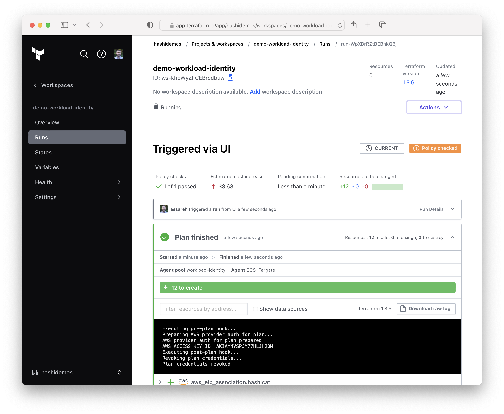
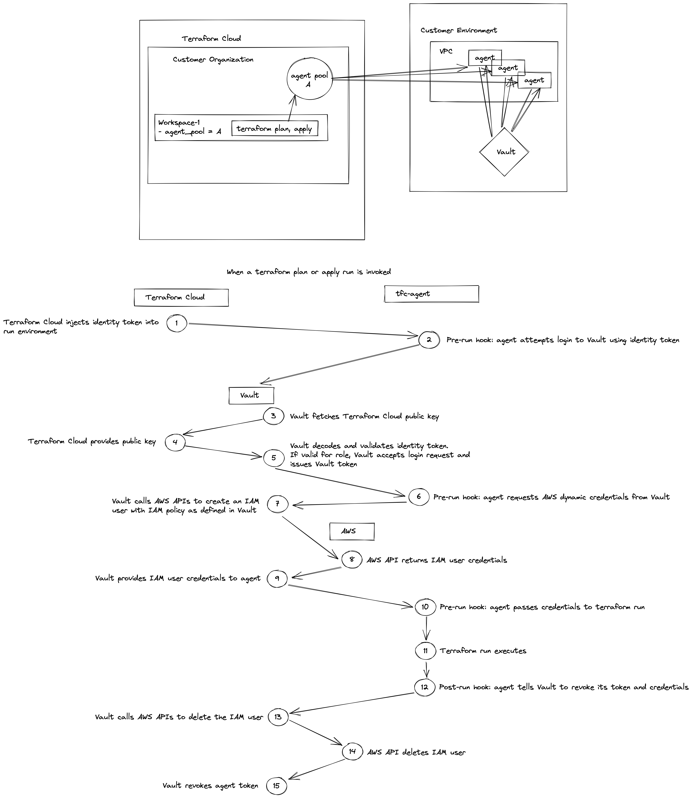

# AWS Dynamic Credentials for Terraform Cloud with Vault and Workload Identity

This repository documents an example workflow for delivering just in time AWS credentials for Terraform provisioning. HashiCorp Vault is used to issue unique one time use AWS credentials. The novel aspects of the approach documented here are leveraging Terraform Cloud run identity to broker trust, and Terraform Cloud Agent hooks to pass credentials outside of terraform state, as well as revoke credentials immediately upon completion of the terraform run.

## Current Challenges 

[This blog post](https://www.hashicorp.com/blog/managing-credentials-in-terraform-cloud-and-enterprise) is a fantastic overview of five different ways to manage credentials and other secrets in Terraform Cloud & Enterprise. 

This repository documents a variation and extension of option 3, Direct Integration with a Vault Plugin, with the following changes:

* The [custom Vault plugin](https://github.com/gitrgoliveira/vault-plugin-auth-tfe) is replaced by Terraform Cloud Workload Identity and Vault's native [`jwt` authentication method](https://developer.hashicorp.com/vault/docs/auth/jwt).
* The [Vault provider](https://registry.terraform.io/providers/hashicorp/vault/latest/docs) is removed in favor of [Terraform Cloud Agent hooks](https://developer.hashicorp.com/terraform/cloud-docs/agents/hooks). This keeps the secrets outside of state files, console outputs, or plan files. 
* The use of agent hooks enables post-run revocation of dynamic secrets.

Building on the blog summary, this approach eliminates 3 of the cons of using this method. It adds a pro which is immediate revocation of credentials upon completion of the run but currently adds one con which is requires running Terraform Cloud agent(s).

## Solution Description

Terraform Cloud Workload Identity provides a trust mechanism (OIDC compliant identity tokens) that enables cryptographically verified authentication of each Terraform Cloud run. These workload identity tokens contain embedded claims identifying the Terraform Cloud organization and workspace where the run is being performed, as well as the type of run (plan or apply). These tokens can be used to log in to HashiCorp Vault and retrieve secrets. The combination of these tokens and Vault's ability to generate short lived credentials on demand enable us to issue unique credentials to each workspace and run type. A plan can be issued read only credentials, while an apply is given read/write permissions. 

The result is a workflow where all cloud credentials are dynamically generated on demand, and scoped to a particular workspace and run type. They are not visible in console output, plan logs, or stored in state files. They are centrally authenticated, issued, logged, tracked, and revoked immediately upon completion of the run. 

## Workflow Steps

1. A run is triggered in the workspace
2. Pre-plan hook authenticates to vault using unique per run token from terraform cloud
3. Pre-plan hook fetches AWS dynamic secret for plans from that workspace
4. Pre-plan hook provides secret to the subsequent terraform plan
5. Terraform plan occurs
6. Post-plan hook revokes token and credentials
7. Pre-apply hook authenticates to vault using unique per run token from terraform cloud
8. Pre-apply hook fetches AWS dynamic secret for applies from that workspace
9. Pre-apply hook provides it to the subsequent terraform apply
10. Terraform apply occurs
11. Post-apply hook revokes token and credentials 

Trust is determined by the per run JWT token. The agents themselves are given no permissions. 

## Architecture and Workflow Diagrams

## Demo

This repo:
* creates a demo Vault instance with the AWS secrets engine enabled
* deploys a terraform cloud agent to be used by terraform cloud workload identity
* creates a demo terraform cloud workspace with workload identity enabled

Requires:
* AWS credentials and sufficient permissions
* TFE_TOKEN for `tfe` provider auth
* fork the [hashicat-aws](https://github.com/hashicorp/hashicat-aws) repo to your github
* provided values for required [tfvars](./variables.tf)

In this example the tfc-agent can be run anywhere that has access to Vault. Whereas in [this tfc-agent-ecs example](https://github.com/assareh/tfc-agent/tree/master/tfc-agent-ecs) which leverages AWS IAM to grant credentials, with workload identity the agent does not need to be run in the cloud with IAM because Terraform Cloud Workload Identity (JWT tokens) are used to establish trust. 

TODO
* AWS container registry instead of docker hub
* error handling in hooks

## Documentation

* [Terraform Cloud Agent hooks](https://developer.hashicorp.com/terraform/cloud-docs/agents/hooks)
* [AWS Secrets Engine](https://developer.hashicorp.com/vault/docs/secrets/aws)